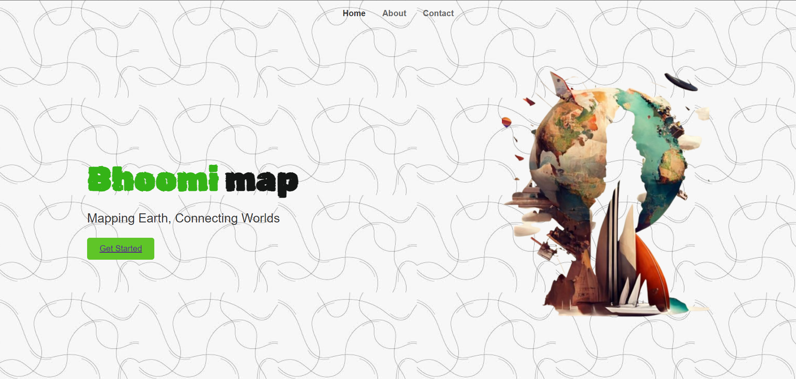

# BhoomiMaps - SpaceApp24-CyberClan
This project aims to develop an innovative web application that functions similarly to Google Maps but is designed specifically to track and display community-related issues. The core feature of this app is a map-based interface where users can search for any location and access a comprehensive record of problems that have occurred in that area over time. These issues will be categorized into various types, including infrastructure breakdowns, safety incidents, environmental challenges, and natural disasters.

The platform will allow users to filter by problem type, providing detailed insights into the history of issues affecting a particular area. Whether it’s a series of road repairs, past flood damage, or recurring crime reports, the platform will offer a clear, visual representation of these issues. By enabling users to pinpoint local problem areas, this tool will empower both community members and decision-makers to make informed decisions and take appropriate actions.

The system will also provide real-time data updates, ensuring that users have access to the latest information. The aim is to create a user-friendly, interactive solution that fosters transparency, encourages proactive problem-solving, and strengthens communities by offering a clear overview of the challenges they face.

> Project Demo Link [click here](https://drive.google.com/file/d/1va_xRSW-t9qvGJKc5uu3DwMlShPGhDgb/view?usp=sharing)

## Sceenshots:
Home Page:

map view:

instalation:
install python and using `pip install -r requirements.txt` or poetry install to install all the dependencies.

run the server using `python main.py `